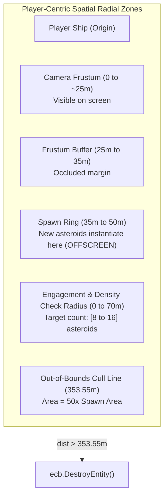
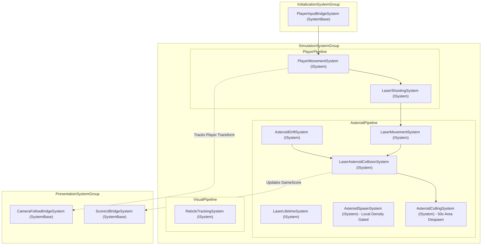
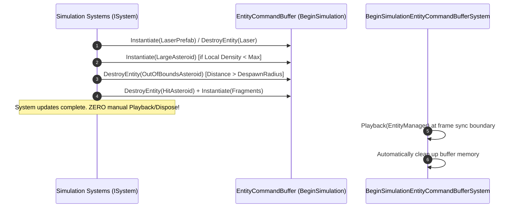
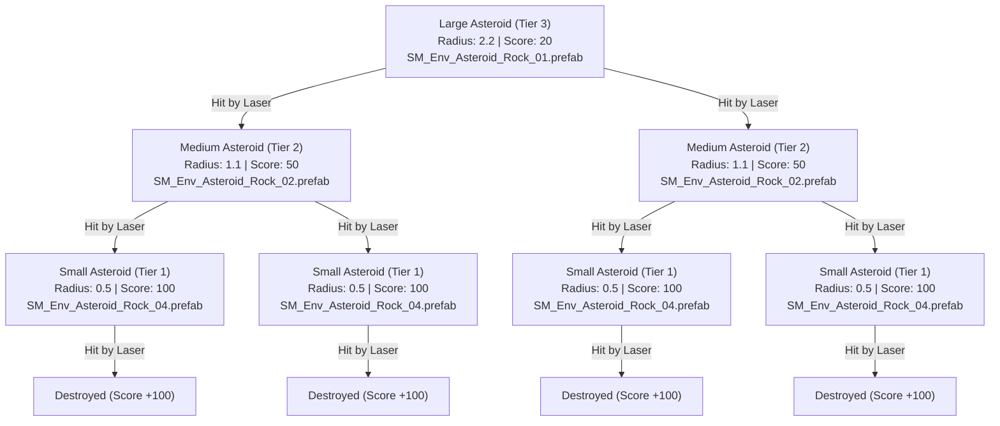

# Asteroids 3D (Isometric) — Overarching DOTS Implementation Plan

**Target Unity Version:** Unity 6.6 (Editor `6000.6.0f1`)  
**Entities Version:** Unity Entities 1.4+ (`6.6.0`)  
**Render Pipeline:** Universal Render Pipeline (URP)  
**Gameplay Model:** Infinite 2D Arcade Simulation in 3D Space (XZ Ground Plane at $Y=0$, Yaw rotation around $Y$-axis, Isometric Camera Tracking Player).  
**Target Main Scene:** `Assets/Scenes/Asteroids.unity`  
**Target SubScene:** `Assets/Scenes/Asteroids_entities.unity`  
**Authoring Recipe Standard:** `templates/authoring-recipe-template.md`

---

## 1. Executive Summary & Core Constraints

This implementation plan establishes the architectural blueprint for an **infinite-map 3D Asteroids game clone** with an isometric camera perspective and **dynamic player-centric density regulation**. The player ship navigates unbounded space on the unmanaged $XZ$ plane ($Y=0$). 

To ensure fair arcade difficulty and eliminate both visual popping and entity crowding:
1. **Camera Frustum Occlusion**: Asteroids spawn strictly outside the active camera frustum (beyond a safe buffer radius of $35\text{m}$), drifting naturally into the player's view from offscreen.
2. **Local Density Interval**: Asteroid population is regulated locally within an engagement radius ($R_{density} = 70\text{m}$) around the player ship:
   - **Target Density Interval**: $[8, 16]$ asteroids.
   - If local density $\ge 16$, spawning is completely suppressed.
   - If local density $< 8$, an accelerated replenishment interval ($0.8\text{s}$) brings the field back into the optimal engagement zone.
   - In the target band $[8, 15]$, a steady interval ($2.5\text{s}$) maintains consistent gameplay challenge.
3. **$50\times$ Out-of-Bounds Culling Bubble**: Asteroids that drift beyond the out-of-bounds radius ($R_{oob} = \sqrt{50} \times R_{spawn\_outer} \approx 7.071 \times 50\text{m} \approx 353.55\text{m}$, representing $50\times$ the area of the spawn zone) are automatically destroyed via `BeginSimulationEntityCommandBufferSystem.Singleton`.

### Non-Negotiable Architectural Rules
1. **Unmanaged Blittable Memory**: All simulation components implement `IComponentData` as unmanaged blittable structs.
2. **Deterministic Record-and-Forget ECB Lifecycle**: All runtime structural modifications (instantiating lasers, culling out-of-bounds asteroids, splitting fragments) are recorded via `BeginSimulationEntityCommandBufferSystem.Singleton`. **Never call `.Playback()` or `.Dispose()` in game systems.**
3. **No `IAspect`**: Direct queries via `SystemAPI.Query<RefRO<T>, RefRW<U>>()` are used everywhere (`IAspect` is obsolete in Entities 1.4+).
4. **Precomputed Squared Distances**: All distance checks in Burst (`math.distancesq`) evaluate against precomputed squared radii (`DensityRadiusSq`, `DespawnRadiusSq`) to avoid expensive `math.sqrt()` calls.
5. **Two-Scope Scene Rigging**: Strict physical separation between Scope 1 (Main Scene managed GameObjects) and Scope 2 (SubScene ECS Authoring & Bakers) conforming to `templates/authoring-recipe-template.md`.

---

## 2. Visual Assets & Scene Rigging Specifications

All visual assets are pre-installed in the project and must be wired into the respective Authoring components and SubScene hierarchies:

| Entity Role | Visual Asset Path | Visual Type | Rigging Mode | Associated Authoring / Baker |
| :--- | :--- | :--- | :--- | :--- |
| **Player Ship** | `Assets/ThirdParty/PolygonSciFiSpace/Prefabs/Vehicles/SM_Ship_Fighter_02.prefab` | Visual Entity | SubScene Instance | `PlayerAuthoring.cs` |
| **Aim Crosshair** | `Assets/ThirdParty/Synty/PolygonSciFiCity/Prefabs/Weapons/SM_Wep_Crosshair_04.prefab` | Visual Entity | SubScene Instance | `ReticleAuthoring.cs` |
| **Laser Bullet** | `Assets/ThirdParty/Synty/PolygonSciFiCity/Prefabs/FX/FX_Laser_Bullet_01.prefab` | Visual Entity | Prefab Asset (Dynamic ECB) | `LaserAuthoring.cs` |
| **Asteroid Large (Tier 3)** | `Assets/ThirdParty/PolygonSciFiSpace/Prefabs/Environment/SM_Env_Asteroid_Rock_01.prefab` | Visual Entity | Prefab Asset (Dynamic ECB) | `AsteroidAuthoring.cs` (Tier 3) |
| **Asteroid Medium (Tier 2)** | `Assets/ThirdParty/PolygonSciFiSpace/Prefabs/Environment/SM_Env_Asteroid_Rock_02.prefab` | Visual Entity | Prefab Asset (Dynamic ECB) | `AsteroidAuthoring.cs` (Tier 2) |
| **Asteroid Small (Tier 1)** | `Assets/ThirdParty/PolygonSciFiSpace/Prefabs/Environment/SM_Env_Asteroid_Rock_04.prefab` | Visual Entity | Prefab Asset (Dynamic ECB) | `AsteroidAuthoring.cs` (Tier 1) |
| **Asteroid Spawner** | *None (Primitive Empty)* | Pure Data | SubScene Instance | `AsteroidSpawnerAuthoring.cs` |
| **Infinite Map Config** | *None (Primitive Empty)* | Pure Data | SubScene Instance | `InfiniteMapAuthoring.cs` |
| **Game Score** | *None (Primitive Empty)* | Pure Data | SubScene Instance | `GameScoreAuthoring.cs` |
| **Score UI HUD** | *uGUI Canvas + TextMeshPro* | Managed Companion | Main Scene Instance | `ScoreDisplayView.cs` |

---

## 3. Master Authoring Recipe (Two-Scope Hierarchy)
*(Conforms to `templates/authoring-recipe-template.md` for human developers and Scene Rigging Agents)*

### Scope 1: Main Scene Hierarchy (`Assets/Scenes/Asteroids.unity`)
> **Rule**: Contains runtime managed objects (Camera, Lights, UI Canvas, and Hybrid bridges). **Never** place unmanaged ECS authoring components here.

```
[Main Scene: Assets/Scenes/Asteroids.unity]
 ├── Main Camera (Camera, AudioListener, UniversalAdditionalCameraData)
 ├── Directional Light (Light, UniversalAdditionalLightData)
 ├── UI Canvas (Canvas [Screen Space - Overlay], CanvasScaler, GraphicRaycaster)
 │    └── ScoreText (TextMeshProUGUI, ScoreDisplayView)
 └── Entities (GameObject with Unity.Scenes.SubScene component)
      └── Linked _SceneAsset -> Assets/Scenes/Asteroids_entities.unity
```

### Scope 2: SubScene Hierarchy (`Assets/Scenes/Asteroids_entities.unity`)
> **Rule**: Contains GameObjects with Authoring `MonoBehaviour` and `Baker<T>` scripts converted into ECS entities during baking.  
> ⛔ **NEVER place Cameras, Lights, UI Canvases, or AudioListeners in the SubScene.**

```
[SubScene: Assets/Scenes/Asteroids_entities.unity]
 ├── PlayerShip (Prefab Instance: SM_Ship_Fighter_02.prefab)
 │    ├── Transform: Position(0, 0, 0), Rotation(0, 0, 0), Scale(1, 1, 1)
 │    └── PlayerAuthoring (ThrustAcceleration: 35, MaxSpeed: 12, Drag: 2, RotationDamping: 18)
 │         └── LaserPrefab Reference -> Assets/ThirdParty/Synty/PolygonSciFiCity/Prefabs/FX/FX_Laser_Bullet_01.prefab
 ├── AimCrosshair (Prefab Instance: SM_Wep_Crosshair_04.prefab)
 │    ├── Transform: Position(0, 0.05, 0), Rotation(0, 0, 0), Scale(1, 1, 1)
 │    └── ReticleAuthoring
 ├── AsteroidSpawner (Pure Data - Primitive Empty GameObject)
 │    ├── Transform: Position(0, 0, 0)
 │    └── AsteroidSpawnerAuthoring
 │         ├── LargeAsteroidPrefab -> Assets/ThirdParty/PolygonSciFiSpace/Prefabs/Environment/SM_Env_Asteroid_Rock_01.prefab
 │         ├── MediumAsteroidPrefab -> Assets/ThirdParty/PolygonSciFiSpace/Prefabs/Environment/SM_Env_Asteroid_Rock_02.prefab
 │         ├── SmallAsteroidPrefab -> Assets/ThirdParty/PolygonSciFiSpace/Prefabs/Environment/SM_Env_Asteroid_Rock_04.prefab
 │         ├── DensityRadius: 70.0, TargetLocalDensityMin: 8, TargetLocalDensityMax: 16
 │         └── BaseSpawnInterval: 2.5, FastSpawnInterval: 0.8, Seed: 1337
 ├── InfiniteMapManager (Pure Data - Primitive Empty GameObject)
 │    ├── Transform: Position(0, 0, 0)
 │    └── InfiniteMapAuthoring (ViewportBufferRadius: 35.0, SpawnOuterRadius: 50.0, OutOfBoundsAreaMultiplier: 50.0)
 └── ScoreManager (Pure Data - Primitive Empty GameObject)
      ├── Transform: Position(0, 0, 0)
      └── GameScoreAuthoring (StartingScore: 0)
```

### Component Wiring Details (SubScene Scope)
| Target Scope | GameObject Path | Component to Add | Property / Field | Value / Asset Reference |
| :--- | :--- | :--- | :--- | :--- |
| **SubScene** | `PlayerShip` | `PlayerAuthoring` | Visual Asset | `Assets/ThirdParty/PolygonSciFiSpace/Prefabs/Vehicles/SM_Ship_Fighter_02.prefab` |
| **SubScene** | `PlayerShip` | `PlayerAuthoring` | `LaserPrefab` | `Assets/ThirdParty/Synty/PolygonSciFiCity/Prefabs/FX/FX_Laser_Bullet_01.prefab` |
| **SubScene** | `AimCrosshair` | `ReticleAuthoring` | Visual Asset | `Assets/ThirdParty/Synty/PolygonSciFiCity/Prefabs/Weapons/SM_Wep_Crosshair_04.prefab` |
| **SubScene** | `AsteroidSpawner` | `AsteroidSpawnerAuthoring` | `LargeAsteroidPrefab` | `Assets/ThirdParty/PolygonSciFiSpace/Prefabs/Environment/SM_Env_Asteroid_Rock_01.prefab` |
| **SubScene** | `AsteroidSpawner` | `AsteroidSpawnerAuthoring` | `MediumAsteroidPrefab` | `Assets/ThirdParty/PolygonSciFiSpace/Prefabs/Environment/SM_Env_Asteroid_Rock_02.prefab` |
| **SubScene** | `AsteroidSpawner` | `AsteroidSpawnerAuthoring` | `SmallAsteroidPrefab` | `Assets/ThirdParty/PolygonSciFiSpace/Prefabs/Environment/SM_Env_Asteroid_Rock_04.prefab` |
| **SubScene** | `InfiniteMapManager` | `InfiniteMapAuthoring` | Visual Asset | `None (Pure Data - Primitive Empty)` |
| **SubScene** | `ScoreManager` | `GameScoreAuthoring` | Visual Asset | `None (Pure Data - Primitive Empty)` |
| **Main Scene** | `Entities` | `Unity.Scenes.SubScene` | `_SceneAsset` | `Assets/Scenes/Asteroids_entities.unity` |
| **Main Scene** | `ScoreText` | `ScoreDisplayView` | `_scoreText` | TextMeshProUGUI Component on `ScoreText` |

---

## 4. Component Layout & Memory Specifications

All data structs reside in namespace `Asteroids.Core`.

### 4.1 Singleton & Configuration Components
* **`InfiniteMapConfig`**:
  ```csharp
  public struct InfiniteMapConfig : IComponentData
  {
      public float ViewportBufferRadius; // Minimum spawn distance outside frustum (e.g. 35m)
      public float SpawnOuterRadius;     // Outer boundary of spawn ring (e.g. 50m)
      public float DespawnRadius;        // Out-of-bounds cull distance (e.g. sqrt(50) * 50m ≈ 353.55m)
      public float DespawnRadiusSq;      // Precomputed squared distance for Burst culling
  }
  ```
  *Memory footprint:* 16 bytes. Baked with `TransformUsageFlags.None`.
* **`GameScore`**:
  ```csharp
  public struct GameScore : IComponentData
  {
      public int CurrentScore;
  }
  ```
  *Memory footprint:* 4 bytes.
* **`GlobalRandom`**:
  ```csharp
  public struct GlobalRandom : IComponentData
  {
      public Unity.Mathematics.Random Value;
  }
  ```
  *Memory footprint:* 4 bytes. Initialized with non-zero seed `math.max(1u, seed)`.

### 4.2 Player Ship Components
* **`PlayerTag`**: Empty tag struct for query filtering (0 bytes).
* **`PlayerInput`**:
  ```csharp
  public struct PlayerInput : IComponentData
  {
      public float2 Movement;         // WASD / Stick direction on XZ plane
      public float3 AimWorldPosition; // Cursor intersection with Y=0 plane
      public bool FireHeld;           // Continuous trigger
      public bool FireTriggered;      // Transient edge press
  }
  ```
  *Memory footprint:* 24 bytes. Polled in `InitializationSystemGroup`.
* **`PlayerMovementData`**:
  ```csharp
  public struct PlayerMovementData : IComponentData
  {
      public float ThrustAcceleration; // e.g. 35.0f
      public float MaxSpeed;           // e.g. 15.0f
      public float Drag;               // Linear damping (e.g. 1.8f)
      public float RotationDamping;    // Slerp angular rate towards cursor (e.g. 18.0f)
      public float3 CurrentVelocity;   // Accumulated linear velocity vector
  }
  ```
  *Memory footprint:* 28 bytes. Processed in `SimulationSystemGroup`.

### 4.3 Projectile & Weapon Components
* **`LaserTag`**: Empty tag struct for laser identification (0 bytes).
* **`ProjectileData`**:
  ```csharp
  public struct ProjectileData : IComponentData
  {
      public float3 Velocity;
      public float Speed;
      public float Radius; // Bounding radius for sphere collision (e.g. 0.3f)
  }
  ```
  *Memory footprint:* 20 bytes.
* **`Lifetime`**:
  ```csharp
  public struct Lifetime : IComponentData
  {
      public float Value; // Time-to-live in seconds (e.g. 1.8f)
  }
  ```
  *Memory footprint:* 4 bytes.
* **`LaserSpawner`**:
  ```csharp
  public struct LaserSpawner : IComponentData
  {
      public Entity LaserPrefab;
      public float FireRate;       // Rounds per second (e.g. 5.0f)
      public float CooldownTimer;  // Internal countdown
      public float3 MuzzleOffset;  // Local offset from ship center
  }
  ```
  *Memory footprint:* 24 bytes.

### 4.4 Asteroid & Obstacle Components
* **`AsteroidTag`**: Empty tag struct for asteroid query filtering (0 bytes).
* **`AsteroidData`**:
  ```csharp
  public struct AsteroidData : IComponentData
  {
      public int Tier;       // 3 = Large, 2 = Medium, 1 = Small
      public float Radius;   // Large: 2.2f, Medium: 1.1f, Small: 0.5f
      public int ScoreValue; // Large: 20, Medium: 50, Small: 100
      public int SplitCount; // Number of children spawned upon hit (default: 2)
  }
  ```
  *Memory footprint:* 16 bytes.
* **`DriftVelocity`**:
  ```csharp
  public struct DriftVelocity : IComponentData
  {
      public float3 Linear;  // Translation velocity on XZ plane
      public float3 Angular; // 3-axis rotation vector (Euler radians/sec)
  }
  ```
  *Memory footprint:* 24 bytes.
* **`AsteroidPrefabsConfig`**:
  ```csharp
  public struct AsteroidPrefabsConfig : IComponentData
  {
      public Entity LargePrefab;
      public Entity MediumPrefab;
      public Entity SmallPrefab;
  }
  ```
  *Memory footprint:* 24 bytes.
* **`AsteroidSpawnerData`**:
  ```csharp
  public struct AsteroidSpawnerData : IComponentData
  {
      public float BaseSpawnInterval;   // Standard interval when density is in range (e.g. 2.5s)
      public float FastSpawnInterval;   // Accelerated interval when density < min (e.g. 0.8s)
      public float CooldownTimer;       // Current countdown timer
      public float DensityRadius;       // Player-centric sampling radius (e.g. 70m)
      public float DensityRadiusSq;     // Precomputed squared radius (e.g. 4900)
      public int TargetLocalDensityMin; // Minimum desired density in radius (e.g. 8)
      public int TargetLocalDensityMax; // Maximum permitted density in radius (e.g. 16)
  }
  ```
  *Memory footprint:* 28 bytes.

### 4.5 Shared & Utility Components
* **`CrosshairReticleTag`**: Tag for aiming reticle visual indicator entity (0 bytes).

---

## 5. Radial Density Architecture & Anti-Popping Zones



### Density Feedback Algorithm (Inside `AsteroidSpawnSystem`)
1. **Count Local Population**: Sum asteroids where $\text{distSq}(asteroid, player) \le R_{density}^2$.
2. **Evaluate Density Gate**:
   - $\text{Count} \ge 16$: **Cap reached**. Skip spawn tick. Set cooldown to `BaseSpawnInterval` ($2.5\text{s}$).
   - $\text{Count} < 8$: **Under-populated**. Instantiate Large asteroid offscreen. Set cooldown to `FastSpawnInterval` ($0.8\text{s}$) to smoothly repopulate.
   - $8 \le \text{Count} < 16$: **Optimal difficulty band**. Instantiate Large asteroid offscreen. Set cooldown to `BaseSpawnInterval` ($2.5\text{s}$).

---

## 6. System Execution Pipeline & Update Ordering



---

## 7. Record-and-Forget ECB Lifecycle

All structural changes occur via `BeginSimulationEntityCommandBufferSystem.Singleton`:



---

## 8. Asteroid Splitting Hierarchy



---

## 9. Atomic Task Roadmap (Infinite Map)

| Task ID | Title | Visual Entity / Asset Contract | Scope & Deliverables | Primary Files |
| :--- | :--- | :--- | :--- | :--- |
| **`task-001`** | **Player Ship Movement & Input** | **Visual Entity**: `SM_Ship_Fighter_02.prefab` instantiated in SubScene at `(0, 0, 0)` | Polling `InputSystem_Actions`, computing isometric mouse raycast, unmanaged movement logic with drag and smooth yaw rotation in infinite space, player authoring & baker. | `PlayerInput.cs`, `PlayerMovementData.cs`, `PlayerInputBridgeSystem.cs`, `PlayerMovementSystem.cs`, `PlayerAuthoring.cs` |
| **`task-002`** | **Infinite Map: Culling & Camera Tracking** | **Pure Data Entity**: Primitive Empty in SubScene | `InfiniteMapConfig` singleton ($50\times$ area ratio), `AsteroidCullingSystem` destroying out-of-bounds asteroids via ECB, and `CameraFollowBridgeSystem` tracking the player ship. | `InfiniteMapConfig.cs`, `AsteroidCullingSystem.cs`, `CameraFollowBridgeSystem.cs`, `InfiniteMapAuthoring.cs` |
| **`task-003`** | **Laser Projectiles & Shooting Mechanism** | **Visual Entity**: `FX_Laser_Bullet_01.prefab` configured as dynamic ECB projectile | Laser spawning with rate limiter, forward projectile motion, lifetime countdown, and ECB destruction upon expiry. | `ProjectileData.cs`, `LaserTag.cs`, `Lifetime.cs`, `LaserSpawner.cs`, `LaserShootingSystem.cs`, `LaserMovementSystem.cs`, `LaserLifetimeSystem.cs`, `LaserAuthoring.cs` |
| **`task-004`** | **Asteroids Drift & 3-Axis Random Tumble** | **Visual Entities**: `SM_Env_Asteroid_Rock_01.prefab` (L), `02.prefab` (M), `04.prefab` (S) | Asteroid identification, tier data, linear velocity, 3-axis rotational angular velocity, unmanaged drift system. | `AsteroidData.cs`, `AsteroidTag.cs`, `DriftVelocity.cs`, `AsteroidDriftSystem.cs`, `AsteroidAuthoring.cs` |
| **`task-005`** | **Density-Regulated Asteroid Ring Spawner** | **Pure Data Entity**: Primitive Empty in SubScene wiring Large/Med/Small asteroid prefabs | Dynamic ring generation ($[35\text{m}, 50\text{m}]$) strictly outside camera frustum, local density evaluation within $70\text{m}$ ($[8, 16]$ interval), adaptive cooldown, inward drift trajectory, and `GlobalRandom` singleton. | `GlobalRandom.cs`, `AsteroidSpawnerData.cs`, `AsteroidPrefabsConfig.cs`, `AsteroidSpawnSystem.cs`, `AsteroidSpawnerAuthoring.cs` |
| **`task-006`** | **Laser-Asteroid Collision & Splitting System** | **Pure Data Entity**: Primitive Empty in SubScene for `GameScore` singleton | Bounding sphere distance query in `ISystem`, laser despawn, tier-based asteroid splitting (Large $\rightarrow$ 2x Medium, Medium $\rightarrow$ 2x Small, Small $\rightarrow$ destroy), and score reward accumulation. | `GameScore.cs`, `LaserAsteroidCollisionSystem.cs`, `GameScoreAuthoring.cs` |
| **`task-007`** | **Score Management & Hybrid uGUI Bridge** | **Managed Companion**: Main Scene Screen-Space Canvas with `TextMeshProUGUI` | Score singleton management, managed `SystemBase` UI bridge synchronizing score data to uGUI Text / TextMeshPro on Screen-Space Canvas. | `ScoreDisplayView.cs`, `ScoreUIBridgeSystem.cs` |
| **`task-008`** | **Aim Crosshair Reticle on Isometric Plane** | **Visual Entity**: `SM_Wep_Crosshair_04.prefab` instantiated in SubScene at `(0, 0.05, 0)` | 3D visual crosshair following `PlayerInput.AimWorldPosition` on the $Y=0.05f$ plane. | `CrosshairReticleTag.cs`, `ReticleTrackingSystem.cs`, `ReticleAuthoring.cs` |

---

## 10. Quality Gates & Verification Standards

1. **Two-Scope Scene Rigging Gate**: Scene Rigging Specialists must strictly follow `templates/authoring-recipe-template.md`. Managed components stay in Main Scene; unmanaged authoring and Bakers stay in SubScene.
2. **Visual Mesh Confirmation**: All visual entities (Player ship, Aim crosshair, Lasers, Asteroid tiers) must have explicit 3D visual prefabs assigned and verified via PlayMode screenshot captures (`unity_screenshot_scene`, `unity_screenshot_game`).
3. **Compilation Gate**: All code must compile with **0 errors and 0 Burst warnings** verified via `anklebreaker-unity-mcp` (`unity_get_compilation_errors`).
4. **Zero Allocation Gate**: Burst simulation systems run with 0 GC allocations per frame.
5. **Lifecycle Discipline**: Zero manual `.Playback()` or `.Dispose()` calls on system-managed ECBs.
